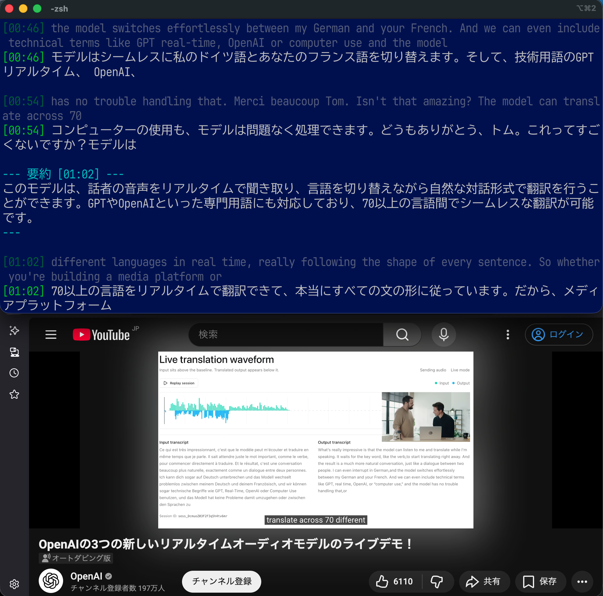

# realtime-interpreter (Windows, macOS 対応 コンソール翻訳アプリ)

音声をマルチモーダル LLM に直接入力して、文字起こしと翻訳テキストをリアルタイムに同時に生成するアプリケーションです。デフォルトは日本語への翻訳です。一定間隔(デフォルトでは1分)で翻訳先の言語で要約を表示します。GUIはありません、すべてターミナルで動作します。

画面の様子は OpenAI が GPT-Realtime-Translate のモデルを発表したときの [YouTube 動画](https://www.youtube.com/watch?v=JOu8v6CBjkE)の音声をリアルタイムに翻訳している様子です。



## サポートしているバックエンド

| バックエンド | 実装 | 特徴 |
|---|---|---|
| `openai-realtime` (デフォルト) | OpenAI GPT-realtime-translate | クラウド、低レイテンシ、サーバでのVAD処理、約 $3/時。|
| `gemini-realtime` | Gemini 3.5 Live Translate | クラウド、低レイテンシ、サーバでのVAD処理、約 $2.25/時。 |
| `openai-chat` | OpenAI 互換 Chat Completions REST API | ローカル動作でVAD処理を行い、WAVに変換した音声をLLMへ入力。Ollamaなどローカルで動くエンジンを想定していますが、エンドポイント変更で OpenAI Webサービスの利用も可です。 |
| `mlx` (macOS のみ) | mlx-vlm + Gemma 4 (ローカル) | ローカル動作、Apple Silicon 専用 macOS ネイティブ |

デフォルトのバックエンドは**両OSで `openai-realtime`**。MLX は Apple Silicon の macOS でのみ利用可能です:

- **Windows**: `openai-realtime` / `gemini-realtime` / `openai-chat`
- **macOS (Apple Silicon)**: `openai-realtime` / `gemini-realtime` / `openai-chat` / `mlx`
- **macOS (Intel)**: `openai-realtime` / `gemini-realtime` / `openai-chat` (mlx は非対応)


## セットアップと起動

インストール (`uv`) から各バックエンドの起動・API キー設定・音声デバイス準備までの**最短手順は [00QUICKSTART.md](00QUICKSTART.md)** にまとめています。本 README は機能の詳細リファレンスです。

## アーキテクチャ

### openai-realtime バックエンド (デフォルト, クラウド)

```
WASAPI loopback (Windows) / BlackHole 2ch (macOS)
  → 24kHz PCM16 で WebSocket ストリーム送信
  → OpenAI gpt-realtime-translate
       サーバ側で VAD + 文字起こし + 翻訳 を一括実行
  → input_transcript.delta (source) / output_transcript.delta (target) を delta 単位で受信
  → 受信ごとに Rich Live が in-place で「進行中」行を更新表示
  → delta が一定時間 (デフォルト 800ms) 来なくなったら debounce で発話確定 (or 最大 8s で強制カット)
  → 確定行を append-only に永続表示 + ログ
  → [60秒ごと] OpenAI Chat Completions (デフォルト gpt-5.4-mini) で過去 60 秒を要約
```

**確定ロジック (alignment-first)**: この API には `*.completed` イベントが無いため、**delta が一定時間 (デフォルト 800ms) 来なくなった時点で発話を確定**します。連続発話では `--openai-rt-max-segment-seconds` (デフォルト 8s) で強制カットします。文単位 (JA `。` / EN `.`) の即時 commit も試したが、本モデルは EN 1 文を JA 複数文に訳すことがあり対応がズレるため、debounce ベースに統一しています。

**自動再接続 (60分制限対策)**: OpenAI Realtime API は 1 接続あたり最大 60 分でサーバから切断されます。本実装は **接続から 55 分でプロアクティブに新接続へ張り替え** (切れ目をほぼゼロに)、加えて切断・瞬断を検知すると**指数バックオフで再接続**します。再接続は新規セッションですが (Realtime に再開ハンドルは無い)、要約履歴はアプリ側で保持するため継続します。再接続の瞬間 (1〜2 秒) に 1 フレーズ程度欠落することがあります。

### gemini-realtime バックエンド (クラウド)

```
WASAPI loopback (Windows) / BlackHole 2ch (macOS)
  → 16kHz PCM16 で WebSocket ストリーム送信
  → Gemini Multimodal Live API (models/gemini-3.5-live-translate-preview)
       inputAudioTranscription (source) / 翻訳 (target) を delta 単位で受信
  → debounce (デフォルト 800ms) / 最大 8s で発話確定して append-only 出力
  → [60秒ごと] gemini-3.1-flash-lite で要約
```

**長時間運用**: Gemini Live は接続 (~10分) / セッション (~15分) に上限がありますが、本実装は **session resumption** (切断をまたいで再接続) と **context window compression** (sliding window でトークン上限を回避) の両方を有効化しており、**数時間の連続セッション**が可能です (実機で 1 時間超の連続翻訳を確認済み)。

**過剰分割対策**: live-translate は短い翻訳単位ごとに `turnComplete` を頻発させます。これを確定トリガにすると 1〜数語の細切れが多発するため、本実装では `turnComplete` を確定に使わず debounce / max_segment のみで束ねています。それでも細切れが気になる場合は `--gemini-rt-debounce-ms` を上げてください (例 1500)。

### openai-chat バックエンド (OpenAI 互換 Chat Completions REST API)

```
WASAPI loopback (Windows) / BlackHole 2ch (macOS)
  → SpeechSegmentCapture (Silero VAD で発話を区切る. 無音 800ms or 最大 8s で finalize)
  → WAV PCM16 にエンコード
  → OpenAI 互換 /v1/chat/completions
       input_audio として WAV を渡し、1 回の推論で "SRC: ... / TGT: ..." を生成
  → 確定したセグメント単位で append-only 出力
```

デフォルトでは Ollama を想定し、`--openai-chat-base-url http://localhost:11434/v1` と `--openai-chat-model gemma4:e4b` を使います。REST 方式のため delta 単位の in-place 表示はなく、発話セグメント確定後に表示されます。

### mlx バックエンド (macOS のみ, ローカル)

```
BlackHole 2ch
  → SpeechSegmentCapture (Silero VAD で発話を区切る. 無音 800ms or 最大 8s で finalize)
  → GemmaAudioTranslator (mlx-vlm + google/gemma-4-e4b-it 4bit)
       1 回の推論で "SRC: ... / TGT: ..." を生成
  → 確定したセグメント単位で append-only 出力
  → [60秒ごと] 同じ Gemma 4 をテキスト専用で再利用して要約
```

## 長時間連続動作に対するセーフティ機構

全バックエンド共通で `--max-session-seconds` (デフォルト 86400 = 24 時間) を超えると自動停止します。従量課金の暴走を防ぐセーフティです。
ユーザーが明示的に制限を解除するなら `--max-session-seconds 0` 指定して下さい。

## 必要なディスク容量

- ローカルで `Ollama` 等を動かす場合は、LLMの実行系と `gemma4:e4b` モデルの格納に必要なストレージ
- MLXバックエンド
  - Gemma 4 E4B 4-bit MLX: 約 5 GB (mlx 初回起動時に `~/.cache/huggingface/hub/` へ自動ダウンロード)
- Python と依存モジュール: 数百 MB

## 前提条件

### Windows

- Windows 11 / Python 3.11〜3.13 / [uv](https://docs.astral.sh/uv/)
- バックエンド別: `openai-realtime` は `OPENAI_API_KEY`、`gemini-realtime` は `GEMINI_API_KEY`、`openai-chat` は Ollama 等 (API キー不要)
- **追加ソフト不要** — システム音声は WASAPI ループバックで取り込みます (管理者権限・仮想オーディオドライバ不要)。`uv sync` で [PyAudioWPatch](https://github.com/s0d3s/PyAudioWPatch) が自動インストールされます
- VDI (リモートデスクトップの「リモート オーディオ」) でも動作確認済み
- mlx バックエンドは Apple Silicon 専用のため Windows では使えません

### macOS

- macOS (Apple Silicon 推奨。Intel Mac も可だが `mlx` バックエンドは非対応)
- Python 3.11〜3.13 / [uv](https://docs.astral.sh/uv/)
- [BlackHole 2ch](https://existential.audio/blackhole/) と Multi-Output Device 設定
- バックエンド別:
  - `openai-realtime`: `OPENAI_API_KEY`
  - `gemini-realtime`: `GEMINI_API_KEY`
  - `openai-chat`: [Ollama](https://ollama.com/) 等の OpenAI 互換サーバ
  - `mlx`: 追加不要 (初回に Gemma 4 を自動 DL)。**Apple Silicon 専用** (Intel Mac では使用不可。`uv sync` でも mlx 系依存はインストールされません)

## 使い方

基本的な起動 (`openai-realtime` / `gemini-realtime` / `openai-chat`)・API キー設定・音声デバイスの準備は [00QUICKSTART.md](00QUICKSTART.md) を参照してください。ここでは quickstart に載っていない使い方を補足します。

### mlx (macOS のみ, ローカル)

```bash
uv run realtime-interpreter --backend mlx
```

### 別の OpenAI 互換サーバ / モデルを使う (openai-chat)

```bash
uv run realtime-interpreter \
  --backend openai-chat \
  --openai-chat-base-url http://localhost:11434/v1 \
  --openai-chat-model gemma4:e2b
```

### デバイス選択 / 終了

終了は `Ctrl+C`。取り込むデバイスは `--device <番号>` で指定し、一覧は `--list-devices` で確認します。**`--device` は `--list-devices` のインデックス番号のみ**を受け付けます(名前指定は廃止)。省略時はプラットフォーム既定(Windows=既定スピーカーの loopback / macOS=BlackHole 2ch)。

#### macOS / Linux(入力デバイス)

```
$ uv run realtime-interpreter --list-devices
Input devices selectable via --device (index: name [in channels]):

   3: Cisco Desk Camera 4K [in=2]
   4: BlackHole 2ch [in=2]  <- default-in
   5: MacBook Proのマイク [in=1]
```

- 行頭の番号(`4:`)を `--device` に渡します。`[in=2]` は入力チャンネル数、`<- default-in` は既定入力。
- 指定例:
  - システム音声(BlackHole 経由・既定): `--device` 省略
  - 物理マイク: `--device 5`
- システム音声の取り込みには、OS 側で「スピーカー + BlackHole 2ch」を含む Multi-Output Device に出力をルーティングする設定が必要です(`--device` とは別の OS 設定)。

#### Windows(WASAPI: 出力 loopback / マイク入力)

`--list-devices` は **出力(loopback の取り込み対象)と入力(マイク)の両方**を表示します。`--device <番号>` で選び、**番号から出力/入力を自動判定**します(番号は両者で一意):

```
C:\> uv run realtime-interpreter --list-devices
Audio devices (Windows, WASAPI)

Output devices — system audio via loopback (default). Select with --device <index>:

  [10] リモート オーディオ  rate=44100   <- default (used when --device omitted)
  [11] EV3285  rate=44100
  [12] EV3285  rate=44100

Input devices — microphones. Select with --device <index>:

  [ 1] マイク (Realtek(R) Audio)  in=2  rate=48000   <- default mic
  [ 6] USB マイク  in=1  rate=44100

Tips:
  - Pass a device index to --device. A number auto-selects output (loopback)
    or microphone; numbers are unique across both lists.
  - Omit --device to capture the default output (speaker).
```

- システム音声(既定): `--device` 省略、または出力の番号(例 `--device 10`)。
- 特定の出力 / **同名**(`[11]` / `[12]`)の区別: 番号で指定(`--device 12`)。
- マイク入力: 入力の番号(例 `--device 6`)。番号で自動的にマイク取り込みになります。

#### 番号指定の注意

- 番号はデバイスの抜き差しで変わり得るため、**`--list-devices` 直後の番号**を使ってください。
- `--device` は**番号のみ**(名前指定は不可)。省略時は既定(Windows=スピーカー loopback / macOS=BlackHole)。

### オプション

| フラグ | 説明 | デフォルト | 対象 |
|---|---|---|---|
| `--backend` | `openai-realtime` / `gemini-realtime` / `openai-chat` / `mlx` | `openai-realtime` | 共通 |
| `--device` | 取り込みデバイスの**番号**(`--list-devices` のインデックス)。Windows は番号で出力(loopback)/入力(マイク)を自動判定。省略で既定(Win=スピーカー / mac=BlackHole) | (既定デバイス) | 共通 |
| `--list-devices` | オーディオデバイス一覧を表示して終了 | — | 共通 |
| `--device-check` | 起動時に出力デバイスのルーティングを確認 (macOS)。デフォルトはスキップ | (off) | 共通 |
| `--source-lang` / `--from` / `-s` | 音声の言語 (ISO 639-1) | `en` | 共通 |
| `--target-lang` / `--to` / `-t` | 翻訳先の言語 (ISO 639-1) | `ja` | 共通 |
| `--list-languages` | 既知の言語コードを表示して終了 | — | 共通 |
| `--summary-interval-seconds` | N 秒ごとに過去 N 秒を要約. `0` で無効 | `60` | 共通 |
| `--max-session-seconds` | この秒数で自動停止 (コスト安全弁). `0` で無制限 | `86400` (24h) | 共通 |
| `--log-dir` | セッションログの出力先 | `logs/` | 共通 |
| `--debug` | 詳細ログを stderr に出す | (off) | 共通 |
| `--system-certs` | TLS 検証を OS 証明書ストアで行う(企業プロキシ対応)。env `REALTIME_INTERPRETER_SYSTEM_CERTS=1` | (off) | 共通 |
| `--openai-rt-model` | Realtime モデル ID | `gpt-realtime-translate` | openai-realtime |
| `--openai-rt-debounce-ms` | 発話の切れ目検出 (debounce) | `800` | openai-realtime |
| `--openai-rt-max-segment-seconds` | 連続発話の強制カット上限. `0` で無効 | `8.0` | openai-realtime |
| `--openai-rt-summary-model` | 要約モデル (Chat Completions) | `gpt-5.4-mini` | openai-realtime |
| `--openai-rt-api-key` | API キー (デフォルト `OPENAI_API_KEY`) | — | openai-realtime |
| `--gemini-rt-model` | Gemini Live モデル ID | `models/gemini-3.5-live-translate-preview` | gemini-realtime |
| `--gemini-rt-debounce-ms` | 発話の切れ目検出 (debounce) | `800` | gemini-realtime |
| `--gemini-rt-max-segment-seconds` | 連続発話の強制カット上限. `0` で無効 | `8.0` | gemini-realtime |
| `--gemini-rt-summary-model` | 要約モデル | `gemini-3.1-flash-lite` | gemini-realtime |
| `--gemini-rt-api-key` | API キー (デフォルト `GEMINI_API_KEY`) | — | gemini-realtime |
| `--openai-chat-base-url` | OpenAI 互換 API の base URL | `http://localhost:11434/v1` | openai-chat |
| `--openai-chat-model` | Chat Completions モデル ID | `gemma4:e4b` | openai-chat |
| `--openai-chat-api-key` | Bearer token (デフォルト `OPENAI_CHAT_API_KEY`→`OPENAI_API_KEY`→`ollama`) | — | openai-chat |
| `--openai-chat-timeout-seconds` | 1 セグメントの REST タイムアウト | `120` | openai-chat |
| `--openai-chat-max-tokens` | 1 セグメントの出力上限 | `384` | openai-chat |
| `--openai-chat-temperature` | サンプリング温度 | `0` | openai-chat |
| `--end-silence-ms` | 無音で発話を区切る長さ | `800` | mlx / openai-chat |
| `--max-segment-seconds` | 連続発話のセグメント最大長 (秒) | `8.0` | mlx / openai-chat |
| `--model` | モデルエイリアス or HuggingFace ID | `e4b` | mlx |
| `--list-models` | プリセット一覧を表示して終了 | — | mlx |

長いフラグには短縮形があります (`--openai-realtime-model` = `--openai-rt-model`、`--gemini-realtime-model` = `--gemini-rt-model` など)。

環境変数:
- `OPENAI_API_KEY`: `openai-realtime` 必須。`openai-chat` では互換サーバが認証を要求する場合のみ
- `GEMINI_API_KEY`: `gemini-realtime` 必須
- `OPENAI_CHAT_API_KEY`: `openai-chat` の Bearer token (Ollama では不要)
- `REALTIME_INTERPRETER_MODEL`: mlx デフォルトモデルの上書き
- `REALTIME_INTERPRETER_SYSTEM_CERTS`: truthy で `--system-certs` を既定 on にする

### 言語の切り替え

ISO 639-1 (2 文字コード) で source / target を指定します。各バックエンド共通。

```bash
uv run realtime-interpreter -s en -t es           # 英語 → スペイン語
uv run realtime-interpreter --from zh --to en     # 中国語 → 英語
uv run realtime-interpreter --list-languages      # 既知の言語コード一覧
```

#### バックエンド別の挙動

| バックエンド | source | target |
|---|---|---|
| **openai-realtime** | `gpt-realtime-whisper` が**自動検出** (source 指定はメタ情報) | `audio.output.language` に target コードを設定 |
| **gemini-realtime** | live-translate が処理 | `translationConfig.targetLanguageCode` に設定 |
| **openai-chat** | プロンプトに言語名を埋め込み (多言語対応はモデル依存) | 同上 |
| **mlx** | プロンプトに言語名を埋め込み (品質は言語ペア依存) | 同上 |

#### OpenAI / Gemini の制約

`gpt-realtime-translate` は **target が ~13 言語に限定** (公式仕様)。範囲外を指定すると API がエラーを返します。本ツールは事前 validation せず API エラーに委ねます。詳細は [OpenAI Realtime Translation ドキュメント](https://developers.openai.com/api/docs/guides/realtime-translation) を参照。

### モデルの切り替え (mlx)

```bash
uv run realtime-interpreter --backend mlx --model e2b   # 軽量・高速
uv run realtime-interpreter --backend mlx --list-models # プリセット一覧
```

| エイリアス | モデル ID | 用途 |
|---|---|---|
| `e4b` (デフォルト) | `mlx-community/gemma-4-e4b-it-4bit` | 通常運用 |
| `e2b` | `mlx-community/gemma-4-e2b-it-4bit` | レイテンシ優先 |
| `e4b-bf16` | `mlx-community/gemma-4-e4b-it-bf16` | 量子化なしの最高品質 |
| `e2b-bf16` | `mlx-community/gemma-4-e2b-it-bf16` | 量子化なし軽量 |

新しい音声入力対応 MLX モデルを使う場合は `src/realtime_interpreter/translator.py` の `MODEL_PRESETS` に追記してください。

## 定期要約 (1 分ごと)

デフォルトで 60 秒ごとに、過去 60 秒間の **source 言語の文字起こし** を target 言語で要約して表示します。要約経路はバックエンドごとに異なります:

- **openai-realtime**: OpenAI Chat Completions (`gpt-5.4-mini`)。ライブ翻訳と同じ `OPENAI_API_KEY` で動作
- **gemini-realtime**: `gemini-3.1-flash-lite`, APIキーもライブ翻訳と同じ
- **openai-chat**: 同じ OpenAI 互換 REST API
- **mlx**: ライブ翻訳と同じ Gemma 4 をテキスト専用モードで再利用

```bash
uv run realtime-interpreter --summary-interval-seconds 0    # 要約を無効化
uv run realtime-interpreter --summary-interval-seconds 30   # 30 秒ごと
```

要約プロンプトは [`src/realtime_interpreter/summarizer.py`](src/realtime_interpreter/summarizer.py) で調整できます。

## チャンクサイズ / 確定タイミングの調整

「文の刻みを細かくしたい / 長台詞を待たずに早く出したい / 細切れを減らしたい」場合に調整します。フラグはバックエンドごとに独立です。

```bash
# openai-realtime: debounce と強制カット上限
uv run realtime-interpreter --openai-rt-debounce-ms 500 --openai-rt-max-segment-seconds 8

# gemini-realtime: 細切れが気になるなら debounce を上げて束ねる
uv run realtime-interpreter --backend gemini-realtime --gemini-rt-debounce-ms 1500

# mlx / openai-chat: VAD の無音長と最大セグメント長
uv run realtime-interpreter --backend mlx --end-silence-ms 500 --max-segment-seconds 6
```

| debounce / end-silence | トレードオフ |
|---|---|
| 短い (200〜500ms) | レスポンス重視. ただし途中で commit して対応がズレる可能性 |
| 800ms (デフォルト) | バランス. 通常の発話間ポーズで commit |
| 長い (1500〜2500ms) | 段落単位で commit. 対応は確実だが表示は遅延 |

### その他のチューニング (ソース直書き)

`src/realtime_interpreter/audio.py` の冒頭 (mlx / openai-chat の VAD):

| 定数 | デフォルト | 意味 |
|---|---|---|
| `VAD_THRESHOLD` | 0.3 | 発話判定の確率しきい値 |
| `MIN_SEGMENT_SECONDS` | 0.5 | これより短いセグメントはノイズとして捨てる |

## スモークテスト / ユニットテスト

```bash
# 音声ファイルで mlx の翻訳を確認 (macOS)
uv run python scripts/smoke_test.py samples/test_en_librispeech.flac

# ユニットテスト一式
uv run pytest
```

## レイテンシ

実機での体感は「発話終了 (無音検知) + 推論」で、目安として**発話終了から 1.5〜3 秒で画面に表示**されます。mlx (M3 Max) は 5.86 秒音声 → EN+JA 出力が約 1.0 秒、モデルロード (キャッシュ済) 約 2.6 秒。クラウドバックエンドはネットワーク往復に依存します。

## 料金の目安

### openai-realtime

| 項目 | 単価 | 1 時間あたり |
|---|---|---|
| `gpt-realtime-translate` (翻訳) | $0.034/分 | 約 $2.04 |
| `gpt-realtime-whisper` (文字起こし) | $0.017/分 | 約 $1.02 |
| `gpt-5.4-mini` (要約, 60s ごと) | 約 $0.0008/回 | 約 $0.05 |
| **合計** | | **約 $3.11 / 時** (1 営業日 8h ≈ $25) |

詳細は [OpenAI Realtime 料金ページ](https://developers.openai.com/api/docs/models/gpt-realtime-translate)。

### gemini-realtime

**従量課金の場合** (契約により無料枠あり):

| 項目 | 単価 | 1 時間あたり |
|---|---|---|
| `gemini-3.5-live-translate-preview` 入力音声 | $3.50/1M tok (≈ $0.0053/分) | 約 $0.32 |
| `gemini-3.5-live-translate-preview` 出力音声 | $21.00/1M tok (≈ $0.0315/分) | 約 $1.89 |
| `gemini-3.1-flash-lite` (要約, 60s ごと) | $0.25/1M (入力) + $1.50/1M (出力) | 約 $0.04 |
| **合計** | | **約 $2.25 / 時** |

出力音声 (TTS) は本ツールでは使わず翻訳テキストのみ利用しますが、`responseModalities=["AUDIO"]` のため課金対象になり、コストの約 85% を占めます。最新の価格・無料枠は [Gemini API 料金ページ](https://ai.google.dev/gemini-api/docs/pricing) を参照 (preview モデルのため変動の可能性あり)。

### openai-chat / mlx

ローカル実行のため**無料** (電力消費のみ)。

## 企業プロキシ / TLS インターセプト環境

社内プロキシが TLS を傍受し独自ルート CA で再署名する環境では、クラウドバックエンド
(openai-realtime / gemini-realtime / OpenAI Web の openai-chat) への HTTPS/WSS 接続が
`CERTIFICATE_VERIFY_FAILED: unable to get local issuer certificate` で失敗します。Python は
同梱 CA (certifi) で検証するため、OS の証明書ストアに導入済みの社内 CA を知らないためです。

**`--system-certs` を付けると、TLS 検証を OS の証明書ストア**(Windows 証明書ストア /
macOS キーチェーン / Linux システム CA)で行うようになり、社内 CA を信頼して接続できます。

```bash
uv run realtime-interpreter --backend openai-realtime --system-certs
# 環境変数でも有効化可: REALTIME_INTERPRETER_SYSTEM_CERTS=1
```

- ⚠ **インストール自体がプロキシ下で失敗する場合**:`uv` 自身も既定では同梱 CA を使うため、
  `uv sync --system-certs`(または `UV_SYSTEM_CERTS=true`)が必要です(`uv --system-certs` は
  uv の DL にのみ効き、アプリ実行時の TLS には効きません。実行時は本ツールの `--system-certs` を使用)。
- 代替として、社内 CA を含む PEM を `SSL_CERT_FILE` / `REQUESTS_CA_BUNDLE` で指定する方法もあります。
- ローカル `openai-chat`(Ollama, `http://localhost`)は TLS 非経由のため本オプションは不要です。

## 既知の制限事項

- mlx バックエンドは macOS (Apple Silicon) 専用。`openai-realtime` / `gemini-realtime` / `openai-chat` は macOS / Windows で動作
- macOS の入力は BlackHole 2ch を想定。Windows はデフォルトスピーカー等を WASAPI loopback で取り込む
- Gemma 4 の音声入力は E2B / E4B に加え `gemma4:12b` でも動作を確認 (openai-chat / Ollama 経由)。ただし 12B は推論が重くレイテンシが大きいためリアルタイム用途では E4B 以下を推奨。mlx バックエンドの `MODEL_PRESETS` は E2B / E4B のみ収録
- リアルタイム両バックエンドは入力文字起こしと訳が別ストリームのため、行頭の対応が 1 セグメント程度ずれることがある
- セグメント完結まで確定行は表示されない設計 (確定済み出力のストリームを目的とする)
- 再接続 (openai-realtime) の瞬間に 1 フレーズ程度欠落することがある
- 中国語の字体(簡体字/繁体字)の扱い(リアルタイム2バックエンド):
  - `gemini-realtime` ([Live translation](https://ai.google.dev/gemini-api/docs/live-api/live-translate)) は **`--to zh-Hans`(簡体字)/ `--to zh-Hant`(繁体字)で字体を指定できる**(`translationConfig.targetLanguageCode` の BCP-47 スクリプトサブタグ)。Gemini が非対応の地域コードや素の `zh` を渡した場合も、アプリ側で字体へマップする(`zh` / `zh-cn` / `zh-sg` → `zh-Hans`、`zh-tw` / `zh-hk` / `zh-mo` → `zh-Hant`)。
  - `openai-realtime` ([gpt-realtime-translate](https://developers.openai.com/cookbook/examples/voice_solutions/realtime_translation_guide)) は出力言語として「中国語」を **1 種類しか提供せず、簡体字/繁体字を選べない**(実質 簡体字/標準中国語)。`zh-Hant` を指定しても繁体字は出力されない(アプリ側では `audio.output.language` に `zh` を渡す)。

## ライセンス

MIT

本プロジェクトは [SatoshiMoriyama/live-translate (realtime-transcriber)](https://github.com/SatoshiMoriyama/live-translate/tree/main/packages/realtime-transcriber) (MIT License) を基に開始しました。
